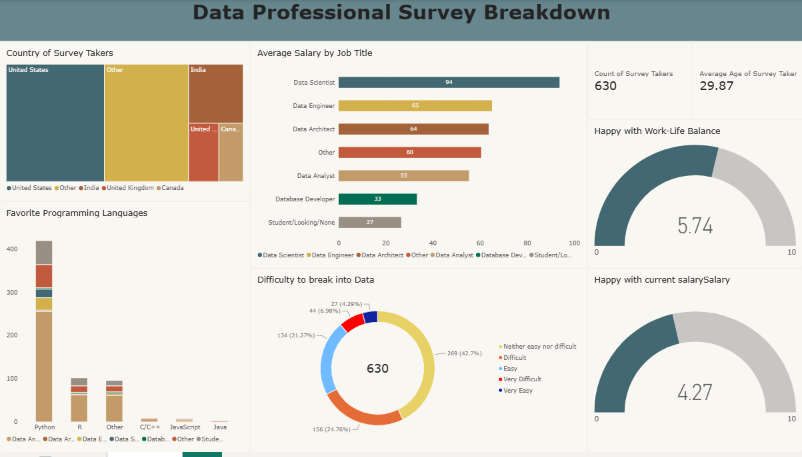

# 📊 Data Professional Survey Analysis | Power BI


## 📌 Project Overview

This project analyzes survey data collected from data professionals to better understand
career roles, salaries, programming language preferences, geographic distribution,
career entry difficulty, and job satisfaction.

The project was completed using Microsoft Power BI, with Power Query used for data
cleaning and transformation and Power BI used for data modeling, analysis, and
visualization.

The goal was to transform a raw survey dataset into an interactive dashboard that
provides clear and useful insights into the data profession.

---

## 🎯 Business Questions

The analysis focuses on answering questions such as:

- Which data-related job titles have the highest average salaries?
- Which countries are most represented among survey participants?
- What programming languages are most commonly preferred?
- How difficult do professionals find it to enter the data field?
- How satisfied are professionals with their salaries?
- How satisfied are professionals with their work-life balance?
- What does the overall survey population look like in terms of age and job roles?

---

## 🛠️ Tools & Technologies

- **Microsoft Power BI**
- **Power Query**
- **DAX**
- **Microsoft Excel**
- Data Cleaning & Transformation
- Data Visualization
- Exploratory Data Analysis

---

## 🔄 Data Preparation

Before building the dashboard, I performed several data preparation and cleaning
steps using Power Query.

### Data cleaning included:

- Removed unnecessary columns that were not relevant to the analysis.
- Reviewed and cleaned categorical values.
- Standardized inconsistent responses.
- Reviewed the "Other" category and unnecessary values in dropdown-based fields.
- Prepared fields for analysis and visualization.
- Checked data types and formatting.
- Structured the dataset for use within Power BI.

The objective was to ensure that the dashboard was based on clean, relevant, and
consistent data.

---

## 📊 Dashboard



### Dashboard Features

The dashboard provides an interactive overview of the survey responses, including:

### 🌎 Geographic Distribution

Shows the countries represented by the survey participants.

### 💼 Salary by Job Title

Compares average salary across different data-related job titles.

### 💻 Programming Languages

Shows the programming languages preferred by survey participants.

### 🎓 Difficulty Entering the Data Field

Analyzes how respondents rated the difficulty of breaking into the data profession.

### 💰 Salary Satisfaction

Shows the average satisfaction level with current salary.

### ⚖️ Work-Life Balance

Shows the average satisfaction level with work-life balance.

### 👥 Survey Demographics

Provides an overview of the number of survey participants and their average age.

---

## 🔍 Key Insights

Some of the key findings from the dashboard include:

- Data Scientist respondents have the highest average salary among the job titles
  shown in the dashboard.
- Data Engineers and Data Architects also rank highly in average salary.
- The United States represents a large portion of the survey responses.
- Python is the most commonly preferred programming language among respondents.
- Respondents report different levels of difficulty when entering the data field.
- Salary satisfaction is lower than work-life balance satisfaction based on the
  dashboard averages.
- The survey contains 630 respondents.

---

## 📈 Analysis Process

The project followed an end-to-end analytics workflow:

Raw Survey Data
        ↓
Data Cleaning
        ↓
Power Query Transformation
        ↓
Data Preparation
        ↓
Data Analysis
        ↓
Dashboard Development
        ↓
Insights & Business Interpretation

---

## 📁 Project Structure

```text
powerbi-data-professional-survey/
│
├── README.md
│
├── dashboard/
│   └── Data_Professional_Survey.pbix
│
├── images/
│   └── dashboard-overview.png
│
├── data/
│   └── README.md
│
└── documentation/
    └── data-cleaning-and-analysis.md
